# Java 비동기 처리

## 프로젝트 개요

Java에서 비동기 처리를 하는 다양한 방식들을 학습하고 비교하는 프로젝트입니다.
"회원가입시 메일 발송과 포인트 적립" 시나리오를 통해 각 방식의 동작 원리와 성능을 분석합니다.

## 비동기 처리 방식별 비교

### 1. Thread 방식

- **패키지**: `com.f1v3.async.thread`
- **특징**: 매번 새로운 스레드 생성
- **장점**: 간단한 구현, 병렬 처리 가능
- **단점**: 스레드 생성/제거 비용, 스레드 수 제어 어려움

### 2. ExecutorService (ThreadPool) 방식

- **패키지**: `com.f1v3.async.executorservice`
- **특징**: 스레드 풀을 사용하여 스레드 재사용
- **장점**: 스레드 생성/제거 비용 절약, 스레드 수 제어 가능
- **단점**: 적절한 풀 크기 설정 필요, 복잡한 구현

### 3. Future 방식

- **패키지**: `com.f1v3.async.future`
- **특징**: ExecutorService의 결과를 Future로 추적
- **장점**: 작업 결과 확인 가능, 타임아웃 설정 가능, 취소 가능
- **단점**: 블로킹 방식, 복잡한 체이닝 어려움

### 4. CompletableFuture 방식

- **패키지**: `com.f1v3.async.completablefuture`
- **특징**: 함수형 프로그래밍 스타일의 비동기 처리
- **장점**: 체이닝 가능, 조합 가능, 예외 처리 용이, 논블로킹
- **단점**: 복잡한 API, 학습 곡선

### 5. Spring Async 방식

- **패키지**: `com.f1v3.async.springasync`
- **특징**: Spring의 @Async 어노테이션을 사용한 비동기 처리
- **장점**: 간단한 설정, Spring 생태계 통합, AOP 기반
- **단점**: Spring 프록시 제한, 같은 클래스 내 호출 불가

## 시스템 아키텍처

### 공통 서비스

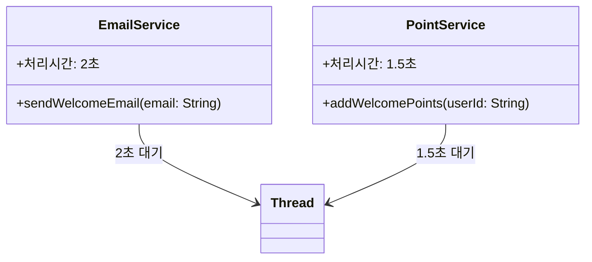
```mermaid
classDiagram
    class EmailService {
        +sendWelcomeEmail(email: String)
        +처리시간: 2초
    }
    
    class PointService {
        +addWelcomePoints(userId: String)
        +처리시간: 1.5초
    }
    
    EmailService --> Thread: 2초 대기
    PointService --> Thread: 1.5초 대기
```

### 동기 vs 비동기 처리 플로우

#### 동기 처리 (Sequential)

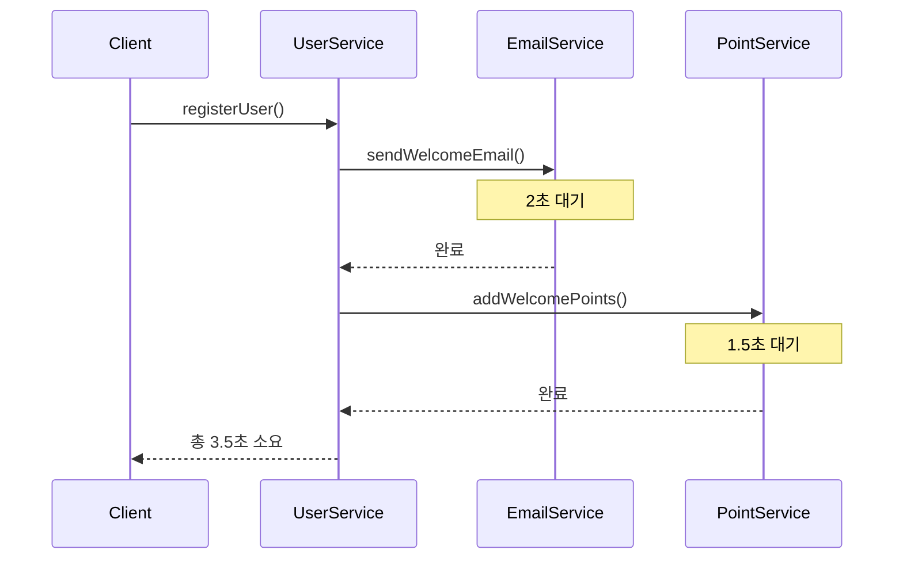
```mermaid
sequenceDiagram
    participant Client
    participant UserService
    participant EmailService
    participant PointService
    
    Client->>UserService: registerUser()
    UserService->>EmailService: sendWelcomeEmail()
    Note over EmailService: 2초 대기
    EmailService-->>UserService: 완료
    UserService->>PointService: addWelcomePoints()
    Note over PointService: 1.5초 대기
    PointService-->>UserService: 완료
    UserService-->>Client: 총 3.5초 소요
```

#### 비동기 처리 (Parallel)

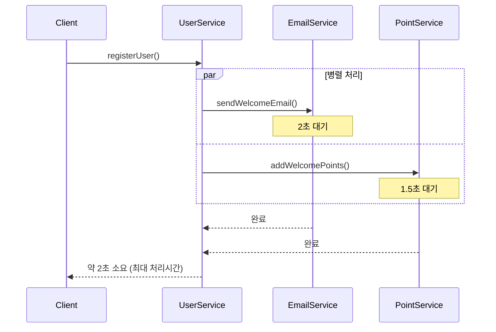
```mermaid
sequenceDiagram
    participant Client
    participant UserService
    participant EmailService
    participant PointService
    
    Client->>UserService: registerUser()
    
    par 병렬 처리
        UserService->>EmailService: sendWelcomeEmail()
        Note over EmailService: 2초 대기
    and
        UserService->>PointService: addWelcomePoints()
        Note over PointService: 1.5초 대기
    end
    
    EmailService-->>UserService: 완료
    PointService-->>UserService: 완료
    UserService-->>Client: 약 2초 소요 (최대 처리시간)
```

## 각 방식별 내부 동작

### 1. Thread 방식

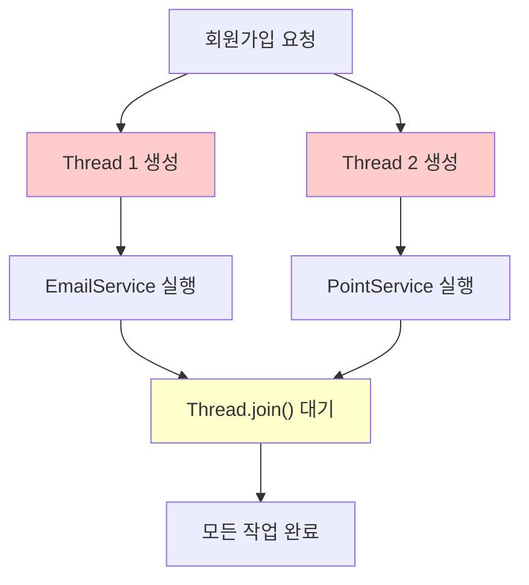
```mermaid
graph TD
    A["회원가입 요청"] --> B["Thread 1 생성"]
    A --> C["Thread 2 생성"]
    B --> D["EmailService 실행"]
    C --> E["PointService 실행"]
    D --> F["Thread.join() 대기"]
    E --> F
    F --> G["모든 작업 완료"]
    
    style B fill:#ffcccc
    style C fill:#ffcccc
    style F fill:#ffffcc
```

### 2. ExecutorService 방식

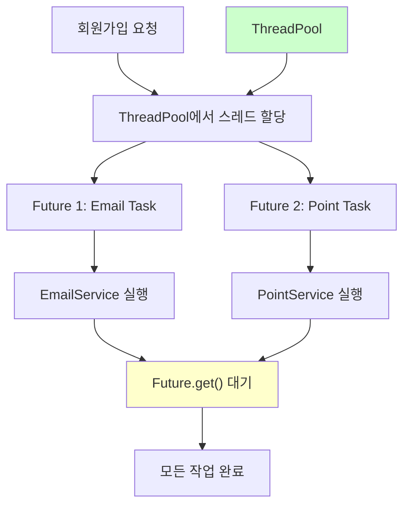
```mermaid
graph TD
    A["회원가입 요청"] --> B["ThreadPool에서 스레드 할당"]
    B --> C["Future 1: Email Task"]
    B --> D["Future 2: Point Task"]
    C --> E["EmailService 실행"]
    D --> F["PointService 실행"]
    E --> G["Future.get() 대기"]
    F --> G
    G --> H["모든 작업 완료"]
    
    I["ThreadPool"] --> B
    style I fill:#ccffcc
    style G fill:#ffffcc
```

### 3. Future 방식

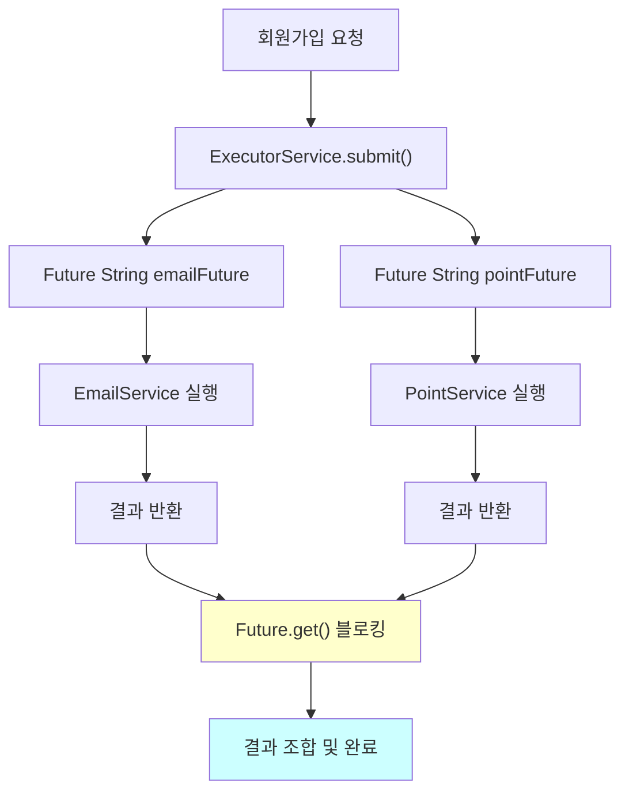
```mermaid
graph TD
    A["회원가입 요청"] --> B["ExecutorService.submit()"]
    B --> C["Future String emailFuture"]
    B --> D["Future String pointFuture"]
    C --> E["EmailService 실행"]
    D --> F["PointService 실행"]
    E --> G["결과 반환"]
    F --> H["결과 반환"]
    G --> I["Future.get() 블로킹"]
    H --> I
    I --> J["결과 조합 및 완료"]
    
    style I fill:#ffffcc
    style J fill:#ccffff
```

### 4. CompletableFuture 방식

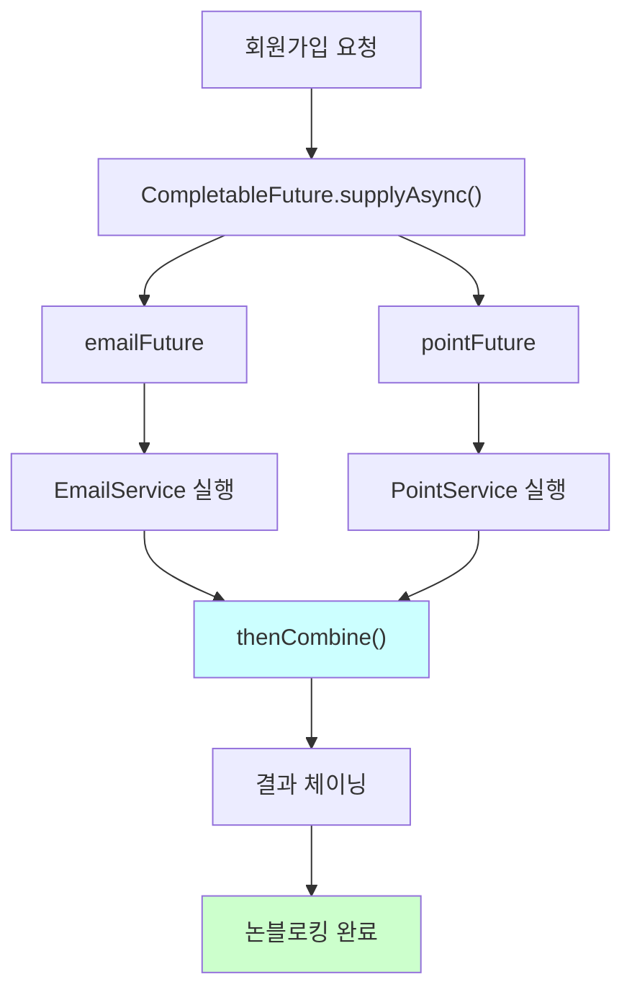
```mermaid
graph TD
    A["회원가입 요청"] --> B["CompletableFuture.supplyAsync()"]
    B --> C["emailFuture"]
    B --> D["pointFuture"]
    C --> E["EmailService 실행"]
    D --> F["PointService 실행"]
    E --> G["thenCombine()"]
    F --> G
    G --> H["결과 체이닝"]
    H --> I["논블로킹 완료"]
    
    style G fill:#ccffff
    style I fill:#ccffcc
```

### 5. Spring Async 방식

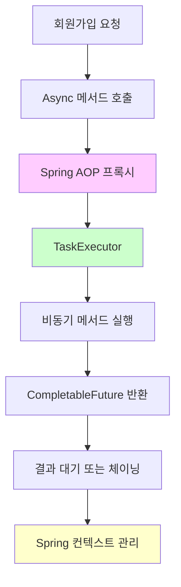
```mermaid
graph TD
    A["회원가입 요청"] --> B["Async 메서드 호출"]
    B --> C["Spring AOP 프록시"]
    C --> D["TaskExecutor"]
    D --> E["비동기 메서드 실행"]
    E --> F["CompletableFuture 반환"]
    F --> G["결과 대기 또는 체이닝"]
    G --> H["Spring 컨텍스트 관리"]
    
    style C fill:#ffccff
    style D fill:#ccffcc
    style H fill:#ffffcc
```

## 각 방식별 상세 동작 흐름과 특징

### 1. Thread 방식 상세 동작

#### 동작 흐름 다이어그램
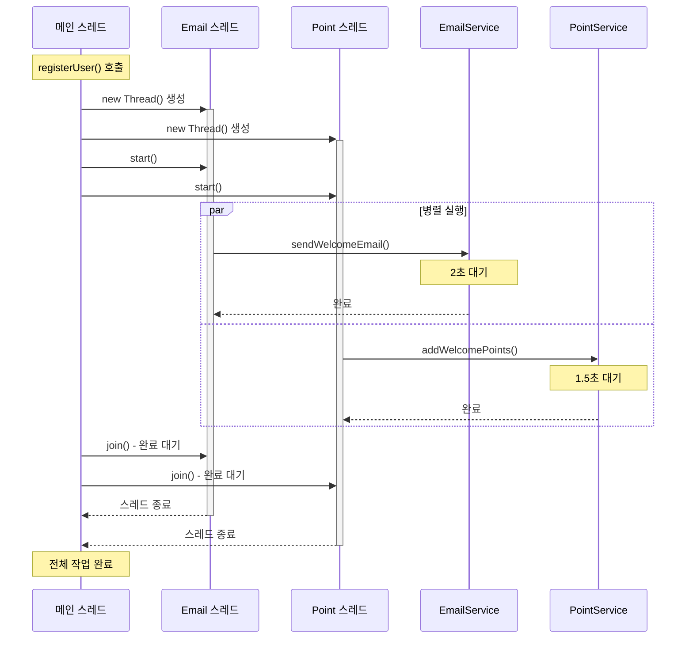
```mermaid
sequenceDiagram
    participant Main as 메인 스레드
    participant ET as Email 스레드
    participant PT as Point 스레드
    participant ES as EmailService
    participant PS as PointService
    
    Note over Main: registerUser() 호출
    Main->>+ET: new Thread() 생성
    Main->>+PT: new Thread() 생성
    
    Main->>ET: start()
    Main->>PT: start()
    
    par 병렬 실행
        ET->>ES: sendWelcomeEmail()
        Note over ES: 2초 대기
        ES-->>ET: 완료
    and
        PT->>PS: addWelcomePoints()
        Note over PS: 1.5초 대기
        PS-->>PT: 완료
    end
    
    Main->>ET: join() - 완료 대기
    Main->>PT: join() - 완료 대기
    ET-->>-Main: 스레드 종료
    PT-->>-Main: 스레드 종료
    Note over Main: 전체 작업 완료
```

#### 실제 코드 구현
```java
public void registerUser(String userId, String email) {
    log.info("=== Thread 방식 회원가입 시작 ===");
    
    // 1. 각각을 별도 스레드로 생성
    Thread emailThread = new Thread(() -> 
        emailService.sendWelcomeEmail(email)
    );
    Thread pointThread = new Thread(() -> 
        pointService.addWelcomePoints(userId)
    );
    
    // 2. 스레드 시작 (OS에게 스레드 생성 요청)
    emailThread.start();
    pointThread.start();
    
    try {
        // 3. 두 작업이 모두 완료될 때까지 대기
        emailThread.join();  // 메인 스레드가 대기
        pointThread.join();  // 메인 스레드가 대기
    } catch (InterruptedException e) {
        Thread.currentThread().interrupt();
    }
    
    log.info("=== 모든 작업 완료 ===");
}
```

#### 스레드 생명주기
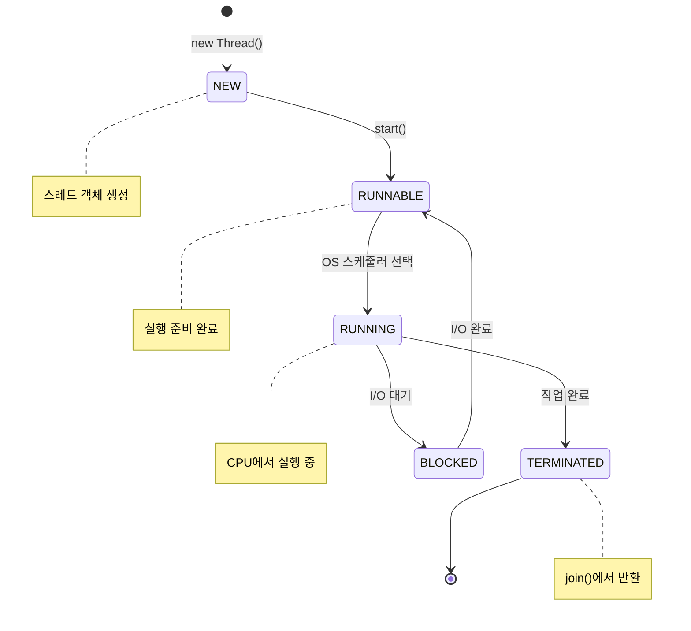
```mermaid
stateDiagram-v2
    [*] --> NEW: new Thread()
    NEW --> RUNNABLE: start()
    RUNNABLE --> RUNNING: OS 스케줄러 선택
    RUNNING --> TERMINATED: 작업 완료
    RUNNING --> BLOCKED: I/O 대기
    BLOCKED --> RUNNABLE: I/O 완료
    TERMINATED --> [*]
    
    note right of NEW: 스레드 객체 생성
    note right of RUNNABLE: 실행 준비 완료
    note right of RUNNING: CPU에서 실행 중
    note right of TERMINATED: join()에서 반환
```

#### Thread 방식의 특징과 한계점

**장점:**
- **간단한 구현**: `new Thread()` 만으로 쉽게 생성 가능
- **직관적인 동작**: 스레드 하나당 작업 하나의 명확한 대응관계
- **독립적인 실행**: 각 스레드가 완전히 독립적으로 실행

**한계점:**
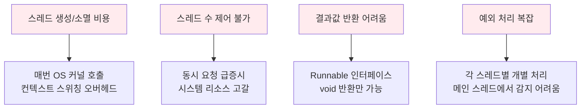
```mermaid
graph TB
    Problem1["스레드 생성/소멸 비용"] --> Cost["매번 OS 커널 호출<br/>컨텍스트 스위칭 오버헤드"]
    Problem2["스레드 수 제어 불가"] --> Resource["동시 요청 급증시<br/>시스템 리소스 고갈"]
    Problem3["결과값 반환 어려움"] --> NoReturn["Runnable 인터페이스<br/>void 반환만 가능"]
    Problem4["예외 처리 복잡"] --> Exception["각 스레드별 개별 처리<br/>메인 스레드에서 감지 어려움"]
    
    style Problem1 fill:#ffebee
    style Problem2 fill:#ffebee
    style Problem3 fill:#ffebee
    style Problem4 fill:#ffebee
```

**이러한 한계점들을 해결하기 위해 등장한 것이 ExecutorService입니다.**

---

### 2. ExecutorService 방식 상세 동작

#### 동작 흐름 다이어그램
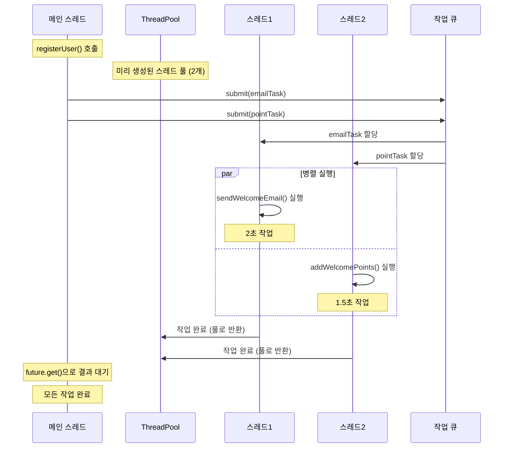
```mermaid
sequenceDiagram
    participant Main as 메인 스레드
    participant Pool as ThreadPool
    participant T1 as 스레드1
    participant T2 as 스레드2
    participant Queue as 작업 큐
    
    Note over Main: registerUser() 호출
    Note over Pool: 미리 생성된 스레드 풀 (2개)
    
    Main->>Queue: submit(emailTask)
    Main->>Queue: submit(pointTask)
    
    Queue->>T1: emailTask 할당
    Queue->>T2: pointTask 할당
    
    par 병렬 실행
        T1->>T1: sendWelcomeEmail() 실행
        Note over T1: 2초 작업
    and
        T2->>T2: addWelcomePoints() 실행
        Note over T2: 1.5초 작업
    end
    
    T1->>Pool: 작업 완료 (풀로 반환)
    T2->>Pool: 작업 완료 (풀로 반환)
    
    Note over Main: future.get()으로 결과 대기
    Note over Main: 모든 작업 완료
```

#### 실제 코드 구현
```java
// 스레드 풀 초기화 (애플리케이션 시작 시)
private final ExecutorService executor = Executors.newFixedThreadPool(2);  // 고정 크기 스레드 풀

public void registerUser(String userId, String email) {
    log.info("=== ExecutorService 방식 시작 ===");
    
    // 1. 작업을 스레드 풀에 제출
    Future<?> emailTask = executor.submit(() -> 
        emailService.sendWelcomeEmail(email)
    );
    Future<?> pointTask = executor.submit(() -> 
        pointService.addWelcomePoints(userId)
    );
    
    try {
        // 2. 결과 대기 (블로킹)
        emailTask.get();  // Email 작업 완료까지 대기
        pointTask.get();  // Point 작업 완료까지 대기
    } catch (Exception e) {
        log.error("작업 실행 중 오류", e);
    }
    
    log.info("=== 모든 작업 완료 ===");
}
```

#### ExecutorService 내부 구조
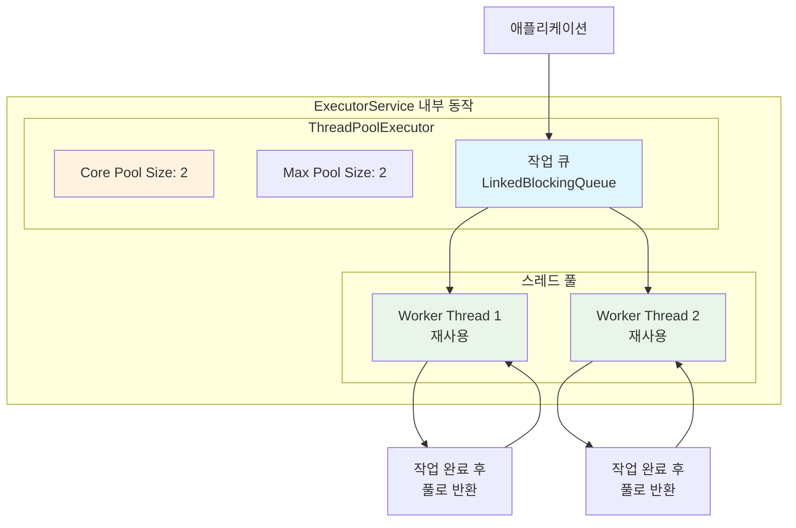
```mermaid
graph TB
    subgraph "ExecutorService 내부 동작"
        subgraph "ThreadPoolExecutor"
            CorePool["Core Pool Size: 2"]
            MaxPool["Max Pool Size: 2"]
            Queue["작업 큐<br/>LinkedBlockingQueue"]
        end
        
        subgraph "스레드 풀"
            T1["Worker Thread 1<br/>재사용"]
            T2["Worker Thread 2<br/>재사용"]
        end
    end
    
    App["애플리케이션"] --> Queue
    Queue --> T1
    Queue --> T2
    
    T1 --> Completed1["작업 완료 후<br/>풀로 반환"]
    T2 --> Completed2["작업 완료 후<br/>풀로 반환"]
    
    Completed1 --> T1
    Completed2 --> T2
    
    style Queue fill:#e1f5fe
    style T1 fill:#e8f5e8
    style T2 fill:#e8f5e8
    style CorePool fill:#fff3e0
```

#### ExecutorService의 특징과 한계점

**Thread 방식 한계점 해결:**
- **스레드 재사용**: `Executors.newFixedThreadPool(2)`로 미리 생성된 스레드 재사용
- **리소스 제어**: 최대 스레드 수 제한으로 시스템 보호
- **작업 큐잉**: 스레드보다 많은 작업 요청시 큐에서 대기

**새로운 장점:**
```java
// 다양한 스레드 풀 생성 방식
Executors.newFixedThreadPool(10);      // 고정 크기
Executors.newCachedThreadPool();       // 동적 크기
Executors.newSingleThreadExecutor();   // 단일 스레드
Executors.newScheduledThreadPool(5);   // 스케줄링 가능
```

**여전한 한계점:**
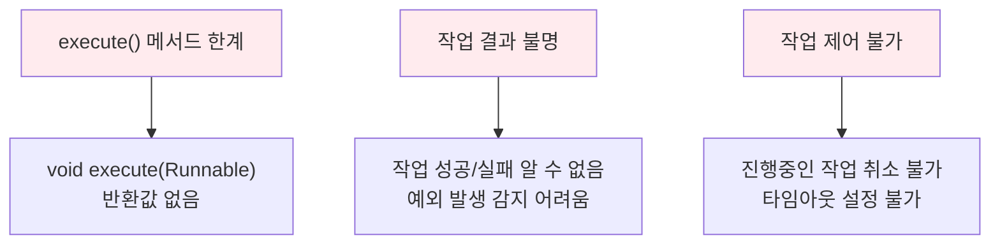
```mermaid
graph TB
    Problem1["execute() 메서드 한계"] --> Detail1["void execute(Runnable)<br/>반환값 없음"]
    Problem2["작업 결과 불명"] --> Detail2["작업 성공/실패 알 수 없음<br/>예외 발생 감지 어려움"]
    Problem3["작업 제어 불가"] --> Detail3["진행중인 작업 취소 불가<br/>타임아웃 설정 불가"]
    
    style Problem1 fill:#ffebee
    style Problem2 fill:#ffebee
    style Problem3 fill:#ffebee
```

**핵심 문제**: ExecutorService는 기본적으로 `Executor` 인터페이스를 확장하므로 `execute(Runnable)` 메서드만 가지고 있어 **작업의 결과나 상태를 추적할 수 없습니다.**

**이러한 한계점을 해결하기 위해 등장한 것이 Future입니다.**

---

### 3. Future 방식 상세 동작

#### 동작 흐름 다이어그램
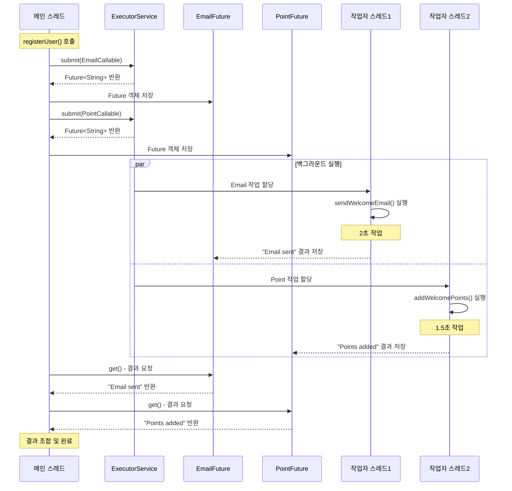
```mermaid
sequenceDiagram
    participant Main as 메인 스레드
    participant Executor as ExecutorService
    participant Future1 as EmailFuture
    participant Future2 as PointFuture
    participant Worker1 as 작업자 스레드1
    participant Worker2 as 작업자 스레드2
    
    Note over Main: registerUser() 호출
    
    Main->>Executor: submit(EmailCallable)
    Executor-->>Main: Future<String> 반환
    Main->>Future1: Future 객체 저장
    
    Main->>Executor: submit(PointCallable)
    Executor-->>Main: Future<String> 반환
    Main->>Future2: Future 객체 저장
    
    par 백그라운드 실행
        Executor->>Worker1: Email 작업 할당
        Worker1->>Worker1: sendWelcomeEmail() 실행
        Note over Worker1: 2초 작업
        Worker1-->>Future1: "Email sent" 결과 저장
    and
        Executor->>Worker2: Point 작업 할당
        Worker2->>Worker2: addWelcomePoints() 실행
        Note over Worker2: 1.5초 작업
        Worker2-->>Future2: "Points added" 결과 저장
    end
    
    Main->>Future1: get() - 결과 요청
    Future1-->>Main: "Email sent" 반환
    
    Main->>Future2: get() - 결과 요청
    Future2-->>Main: "Points added" 반환
    
    Note over Main: 결과 조합 및 완료
```

#### 실제 코드 구현
```java
public String registerUser(String userId, String email) {
    log.info("=== Future 방식 시작 ===");
    
    // 1. Callable 작업 정의 (반환값 있음)
    Callable<String> emailTask = () -> {
        emailService.sendWelcomeEmail(email);
        return "메일 발송 완료: " + email;  // 결과 반환 가능!
    };
    
    Callable<String> pointTask = () -> {
        pointService.addWelcomePoints(userId);
        return "포인트 적립 완료: " + userId;  // 결과 반환 가능!
    };
    
    // 2. 작업 제출 및 Future 획득
    Future<String> emailFuture = executor.submit(emailTask);
    Future<String> pointFuture = executor.submit(pointTask);
    
    try {
        // 3. 다양한 방식으로 결과 대기 가능
        String emailResult = emailFuture.get(5, TimeUnit.SECONDS);  // 타임아웃 설정
        String pointResult = pointFuture.get();  // 무한 대기
        
        return emailResult + ", " + pointResult;
    } catch (TimeoutException e) {
        log.error("작업 타임아웃 발생", e);
        // 4. 작업 취소 가능
        emailFuture.cancel(true);
        pointFuture.cancel(true);
        return "작업 타임아웃";
    } catch (ExecutionException e) {
        log.error("작업 실행 중 오류", e.getCause());
        return "작업 실패";
    }
}
```

#### Future 상태 관리와 제어
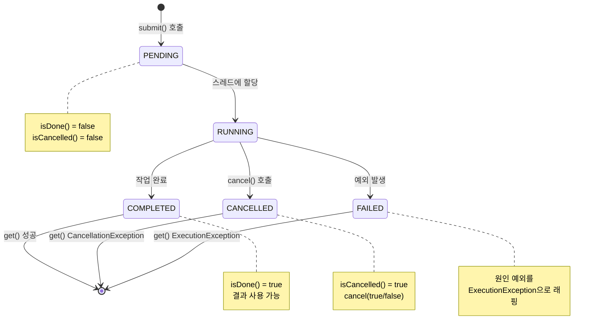
```mermaid
stateDiagram-v2
    [*] --> PENDING: submit() 호출
    PENDING --> RUNNING: 스레드에 할당
    RUNNING --> COMPLETED: 작업 완료
    RUNNING --> CANCELLED: cancel() 호출
    RUNNING --> FAILED: 예외 발생
    
    COMPLETED --> [*]: get() 성공
    CANCELLED --> [*]: get() CancellationException
    FAILED --> [*]: get() ExecutionException
    
    note right of PENDING: isDone() = false<br/>isCancelled() = false
    note right of COMPLETED: isDone() = true<br/>결과 사용 가능
    note right of CANCELLED: isCancelled() = true<br/>cancel(true/false)
    note right of FAILED: 원인 예외를<br/>ExecutionException으로 래핑
```

#### Future의 특징과 한계점

**ExecutorService 한계점 해결:**
```java
// Future가 제공하는 강력한 기능들
Future<String> future = executor.submit(callable);

// 1. 결과 반환 가능
String result = future.get();

// 2. 타임아웃 설정 가능
String result = future.get(5, TimeUnit.SECONDS);

// 3. 작업 상태 확인 가능
boolean isDone = future.isDone();
boolean isCancelled = future.isCancelled();

// 4. 작업 취소 가능
boolean cancelled = future.cancel(true);  // 강제 중단
```

**새로운 장점:**
- **결과 추적**: `Callable<T>` 사용으로 반환값 처리 가능
- **예외 처리**: `ExecutionException`으로 작업 중 발생한 예외 캐치
- **작업 제어**: 타임아웃, 취소, 상태 확인 등 세밀한 제어

**여전한 한계점:**
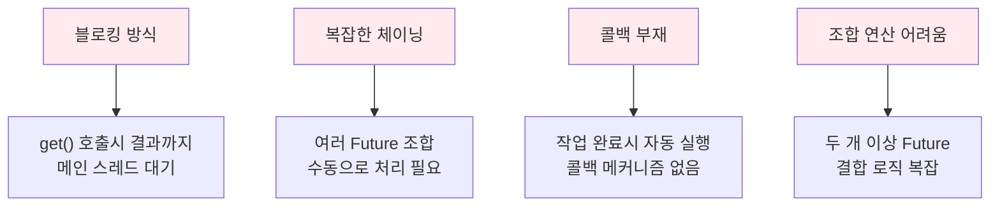
```mermaid
graph TB
    Problem1["블로킹 방식"] --> Detail1["get() 호출시 결과까지<br/>메인 스레드 대기"]
    Problem2["복잡한 체이닝"] --> Detail2["여러 Future 조합<br/>수동으로 처리 필요"]
    Problem3["콜백 부재"] --> Detail3["작업 완료시 자동 실행<br/>콜백 메커니즘 없음"]
    Problem4["조합 연산 어려움"] --> Detail4["두 개 이상 Future<br/>결합 로직 복잡"]
    
    style Problem1 fill:#ffebee
    style Problem2 fill:#ffebee
    style Problem3 fill:#ffebee
    style Problem4 fill:#ffebee
```

**핵심 문제**: Future는 여전히 **블로킹 방식**이며, **복잡한 비동기 작업 체이닝**이 어렵습니다.

**이러한 한계점을 해결하기 위해 등장한 것이 CompletableFuture입니다.**

---

### 4. CompletableFuture 방식 상세 동작

#### 동작 흐름 다이어그램
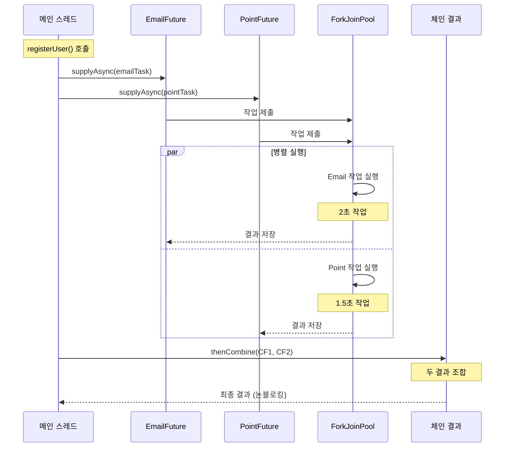
```mermaid
sequenceDiagram
    participant Main as 메인 스레드
    participant CF1 as EmailFuture
    participant CF2 as PointFuture
    participant FJP as ForkJoinPool
    participant Chain as 체인 결과
    
    Note over Main: registerUser() 호출
    
    Main->>CF1: supplyAsync(emailTask)
    Main->>CF2: supplyAsync(pointTask)
    
    CF1->>FJP: 작업 제출
    CF2->>FJP: 작업 제출
    
    par 병렬 실행
        FJP->>FJP: Email 작업 실행
        Note over FJP: 2초 작업
        FJP-->>CF1: 결과 저장
    and
        FJP->>FJP: Point 작업 실행
        Note over FJP: 1.5초 작업
        FJP-->>CF2: 결과 저장
    end
    
    Main->>Chain: thenCombine(CF1, CF2)
    Note over Chain: 두 결과 조합
    
    Chain-->>Main: 최종 결과 (논블로킹)
```

#### 실제 코드 구현
```java
public void registerUser(String userId, String email) {
    log.info("=== CompletableFuture 방식 시작 ===");
    
    // 1. 비동기 작업 시작 (논블로킹)
    CompletableFuture<String> emailFuture = 
        CompletableFuture.supplyAsync(() -> {
            emailService.sendWelcomeEmail(email);
            return "메일 발송 완료";
        }, executorService);
    
    CompletableFuture<String> pointFuture = 
        CompletableFuture.supplyAsync(() -> {
            pointService.addWelcomePoints(userId);
            return "포인트 적립 완료";
        }, executorService);
    
    // 2. 두 결과를 조합하여 처리 (함수형 체이닝)
    CompletableFuture<String> combinedResult = 
        emailFuture.thenCombine(pointFuture, 
            (emailResult, pointResult) -> 
                emailResult + " & " + pointResult
        )
        .thenApply(result -> "[완료] " + result)  // 결과 변환
        .thenCompose(result ->                    // 다른 비동기 작업과 연결
            CompletableFuture.supplyAsync(() -> 
                "최종: " + result
            )
        );
    
    // 3. 완료 후 후속 작업 (비동기 콜백)
    combinedResult
        .thenAccept(result -> 
            log.info("=== 모든 작업 완료: {} ===", result))
        .exceptionally(throwable -> {
            log.error("작업 실행 중 오류", throwable);
            return null;
        });
    
    // 4. 필요시에만 블로킹
    combinedResult.join();
}
```

#### CompletableFuture 체이닝과 조합
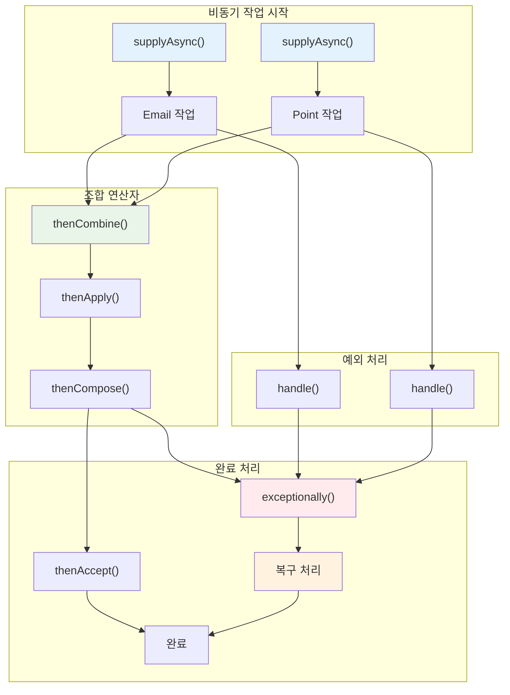
```mermaid
graph TB
    subgraph "비동기 작업 시작"
        Supply1["supplyAsync()"] --> Task1["Email 작업"]
        Supply2["supplyAsync()"] --> Task2["Point 작업"]
    end
    
    subgraph "조합 연산자"
        Task1 --> Combine["thenCombine()"]
        Task2 --> Combine
        Combine --> Apply["thenApply()"]
        Apply --> Compose["thenCompose()"]
    end
    
    subgraph "완료 처리"
        Compose --> Accept["thenAccept()"]
        Compose --> Exception["exceptionally()"]
        Accept --> End["완료"]
        Exception --> Recovery["복구 처리"]
        Recovery --> End
    end
    
    subgraph "예외 처리"
        Task1 --> Handle1["handle()"]
        Task2 --> Handle2["handle()"]
        Handle1 --> Exception
        Handle2 --> Exception
    end
    
    style Supply1 fill:#e3f2fd
    style Supply2 fill:#e3f2fd
    style Combine fill:#e8f5e8
    style Exception fill:#ffebee
    style Recovery fill:#fff3e0
```

#### CompletableFuture의 특징과 장점

**Future 한계점 해결:**
```java
// 1. 논블로킹 조합 연산
CompletableFuture.allOf(future1, future2, future3)
    .thenRun(() -> log.info("모든 작업 완료"));

// 2. 함수형 체이닝
future
    .thenApply(String::toUpperCase)       // 결과 변환
    .thenCompose(this::processResult)     // 다른 Future와 연결
    .thenAccept(System.out::println)      // 결과 소비
    .exceptionally(ex -> {                // 예외 처리
        log.error("Error", ex);
        return null;
    });

// 3. 다양한 조합 방식
CompletableFuture.anyOf(future1, future2);     // 먼저 완료되는 것
CompletableFuture.allOf(future1, future2);     // 모든 작업 완료
future1.thenCombine(future2, (a, b) -> a + b); // 두 결과 조합
```

**강력한 새 기능들:**
- **논블로킹 체이닝**: 메인 스레드를 블로킹하지 않고 후속 작업 연결
- **함수형 프로그래밍**: `thenApply`, `thenCompose`, `thenCombine` 등 풍부한 연산자
- **예외 처리**: `exceptionally`, `handle`, `whenComplete` 등 우아한 예외 처리
- **조합 연산**: 여러 CompletableFuture를 쉽게 조합

**남은 한계점:**
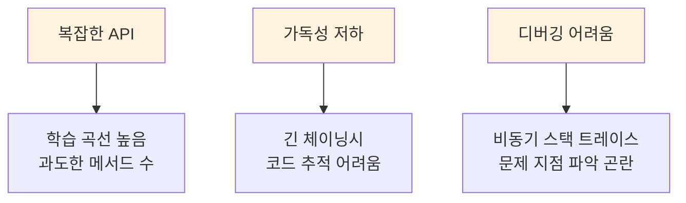
```mermaid
graph TB
    Problem1["복잡한 API"] --> Detail1["학습 곡선 높음<br/>과도한 메서드 수"]
    Problem2["가독성 저하"] --> Detail2["긴 체이닝시<br/>코드 추적 어려움"]
    Problem3["디버깅 어려움"] --> Detail3["비동기 스택 트레이스<br/>문제 지점 파악 곤란"]
    
    style Problem1 fill:#fff3e0
    style Problem2 fill:#fff3e0
    style Problem3 fill:#fff3e0
```

**이러한 복잡성을 Spring Framework에서 간소화한 것이 @Async입니다.**

---

### 5. Spring Async 방식 상세 동작

#### 동작 흐름 다이어그램
```mermaid
sequenceDiagram
    participant Client as 클라이언트
    participant Proxy as Spring 프록시
    participant Service as UserService
    participant Config as AsyncConfig
    participant Executor as TaskExecutor
    participant Method as @Async 메서드
    
    Client->>Proxy: registerUser() 호출
    Proxy->>Config: TaskExecutor 조회
    Config-->>Proxy: TaskExecutor 반환
    
    Proxy->>Service: 실제 메서드 호출
    
    par AOP 기반 비동기 실행
        Service->>Proxy: sendWelcomeEmailAsync() 호출
        Proxy->>Executor: 작업 제출
        Executor->>Method: 별도 스레드에서 실행
        Method-->>Proxy: CompletableFuture 반환
    and
        Service->>Proxy: addWelcomePointsAsync() 호출
        Proxy->>Executor: 작업 제출
        Executor->>Method: 별도 스레드에서 실행
        Method-->>Proxy: CompletableFuture 반환
    end
    
    Service->>Service: allOf().join()
    Service-->>Client: 결과 반환
```

#### 실제 코드 구현

**AsyncConfig 설정:**
```java
@Configuration
@EnableAsync  // Spring Async 활성화
public class AsyncConfig implements AsyncConfigurer {
    
    @Override
    public Executor getAsyncExecutor() {
        ThreadPoolTaskExecutor executor = new ThreadPoolTaskExecutor();
        executor.setCorePoolSize(5);        // 기본 스레드 수
        executor.setMaxPoolSize(10);        // 최대 스레드 수
        executor.setQueueCapacity(100);     // 큐 용량
        executor.setThreadNamePrefix("Async-");
        executor.setRejectedExecutionHandler(
            new ThreadPoolExecutor.CallerRunsPolicy()  // 거절 정책
        );
        executor.initialize();
        return executor;
    }
    
    @Override
    public AsyncUncaughtExceptionHandler getAsyncUncaughtExceptionHandler() {
        return (ex, method, params) -> 
            log.error("Async method error: {}", method.getName(), ex);
    }
}
```

**Service 구현:**
```java
@Service
@RequiredArgsConstructor
public class SpringAsyncUserService {
    
    // @Async 메서드들 - 단순한 어노테이션만으로 비동기 처리!
    @Async
    public CompletableFuture<String> sendWelcomeEmailAsync(String email) {
        emailService.sendWelcomeEmail(email);
        return CompletableFuture.completedFuture("메일 발송 완료");
    }
    
    @Async
    public CompletableFuture<String> addWelcomePointsAsync(String userId) {
        pointService.addWelcomePoints(userId);
        return CompletableFuture.completedFuture("포인트 적립 완료");
    }
    
    // 메인 비즈니스 로직 - 기존 CompletableFuture 활용
    public void registerUser(String userId, String email) {
        CompletableFuture<String> emailFuture = sendWelcomeEmailAsync(email);
        CompletableFuture<String> pointFuture = addWelcomePointsAsync(userId);
        
        // Spring이 자동으로 CompletableFuture를 반환
        CompletableFuture.allOf(emailFuture, pointFuture).join();
    }
}
```

#### Spring AOP 동작 원리
```mermaid
graph TB
    subgraph "Spring 컨테이너"
        Bean["실제 Bean<br/>SpringAsyncUserService"]
        Proxy["AOP 프록시<br/>$$EnhancerBySpringCGLIB"]
        Interceptor["AsyncExecutionInterceptor"]
        Config["AsyncConfig"]
    end
    
    subgraph "TaskExecutor"
        ThreadPool["ThreadPoolTaskExecutor"]
        Thread1["Async-1"]
        Thread2["Async-2"]
        Thread3["Async-3"]
    end
    
    Client["클라이언트"] --> Proxy
    Proxy --> Interceptor
    Interceptor --> Config
    Config --> ThreadPool
    ThreadPool --> Thread1
    ThreadPool --> Thread2
    ThreadPool --> Thread3
    
    Thread1 --> Bean
    Thread2 --> Bean
    Thread3 --> Bean
    
    style Proxy fill:#e3f2fd
    style Interceptor fill:#f3e5f5
    style Config fill:#e8f5e8
    style ThreadPool fill:#fff3e0
```

#### Spring Async의 특징과 한계점

**CompletableFuture 복잡성 해결:**
```java
// Before: 복잡한 CompletableFuture 코드
CompletableFuture<String> future = CompletableFuture.supplyAsync(() -> {
    emailService.sendWelcomeEmail(email);
    return "완료";
}, customExecutor);

// After: 간단한 Spring @Async
@Async
public CompletableFuture<String> sendEmailAsync(String email) {
    emailService.sendWelcomeEmail(email);
    return CompletableFuture.completedFuture("완료");
}
```

**Spring 생태계 통합 장점:**
- **AOP 기반**: 기존 코드 수정 최소화로 비동기 적용
- **설정 기반**: XML, Java Config를 통한 중앙 집중식 관리
- **트랜잭션 연동**: `@Transactional`과 함께 사용 가능
- **시큐리티 연동**: SecurityContext 자동 전파
- **모니터링**: Spring Actuator를 통한 스레드 풀 모니터링

**Spring Async 한계점:**
```mermaid
graph TB
    Problem1["프록시 제약"] --> Detail1["같은 클래스 내 메서드 호출시<br/>@Async 동작 안함"]
    Problem2["Spring 의존성"] --> Detail2["Spring Framework<br/>강한 결합"]
    Problem3["설정 복잡성"] --> Detail3["여러 Executor 관리시<br/>설정 복잡"]
    Problem4["디버깅 어려움"] --> Detail4["프록시 + AOP로<br/>호출 스택 복잡"]
    
    style Problem1 fill:#ffebee
    style Problem2 fill:#fff3e0
    style Problem3 fill:#fff3e0
    style Problem4 fill:#fff3e0
```

**핵심 제약사항**: 
```java
@Service
public class UserService {
    
    @Async
    public void asyncMethod() { ... }
    
    public void syncMethod() {
        // 같은 클래스 내 호출 - @Async 동작 안함!
        this.asyncMethod();  
        
        // 다른 Bean 주입받아 호출 - @Async 정상 동작
        otherService.asyncMethod();
    }
}
```

---

### 비동기 처리 방식 진화 요약

```mermaid
flowchart TD
    Thread["1-Thread"]
    ThreadFeatures["매번 생성/소멸<br/>결과 반환 불가<br/>리소스 제어 어려움"]
    
    ExecutorService["2-ExecutorService"]
    ExecutorFeatures["스레드 풀 재사용<br/>결과 반환 불가<br/>작업 제어 불가"]
    
    Future["3-Future"]
    FutureFeatures["결과 반환 가능<br/>작업 제어 가능<br/>블로킹 방식<br/>체이닝 어려움"]
    
    CompletableFuture["4-CompletableFuture"]
    CompletableFeatures["논블로킹 체이닝<br/>함수형 프로그래밍<br/>강력한 조합 연산<br/>복잡한 API"]
    
    SpringAsync["5-Spring @Async"]
    SpringFeatures["간단한 어노테이션<br/>Spring 생태계 통합<br/>AOP 기반 투명성<br/>프록시 제약"]
    
    Thread --> ThreadFeatures
    Thread --> ExecutorService
    ExecutorService --> ExecutorFeatures
    ExecutorService --> Future
    Future --> FutureFeatures
    Future --> CompletableFuture
    CompletableFuture --> CompletableFeatures
    CompletableFuture --> SpringAsync
    SpringAsync --> SpringFeatures
    
    style Thread fill:#ffebee
    style ExecutorService fill:#fff3e0
    style Future fill:#e8f5e8
    style CompletableFuture fill:#e3f2fd
    style SpringAsync fill:#f3e5f5
    style ThreadFeatures fill:#ffebee,color:#000
    style ExecutorFeatures fill:#fff3e0,color:#000
    style FutureFeatures fill:#e8f5e8,color:#000
    style CompletableFeatures fill:#e3f2fd,color:#000
    style SpringFeatures fill:#f3e5f5,color:#000
```

각 방식은 이전 방식의 한계점을 해결하면서 발전해왔으며, **상황에 맞는 적절한 선택**이 중요합니다.
