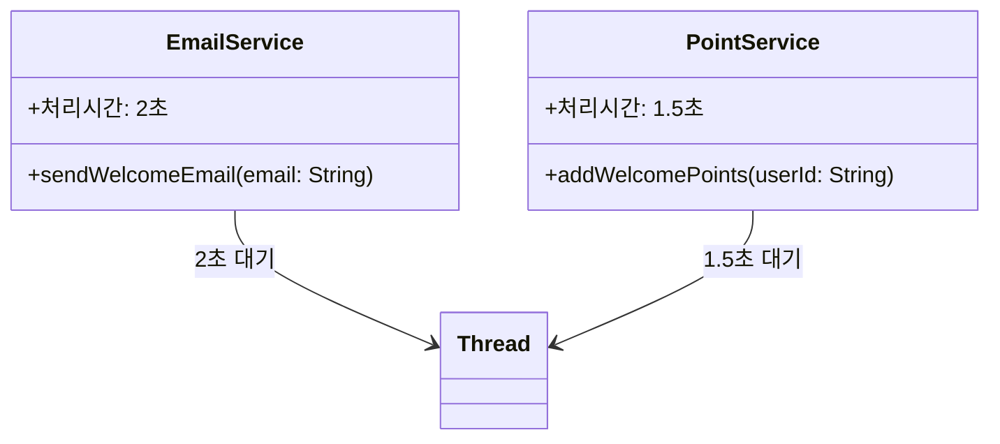
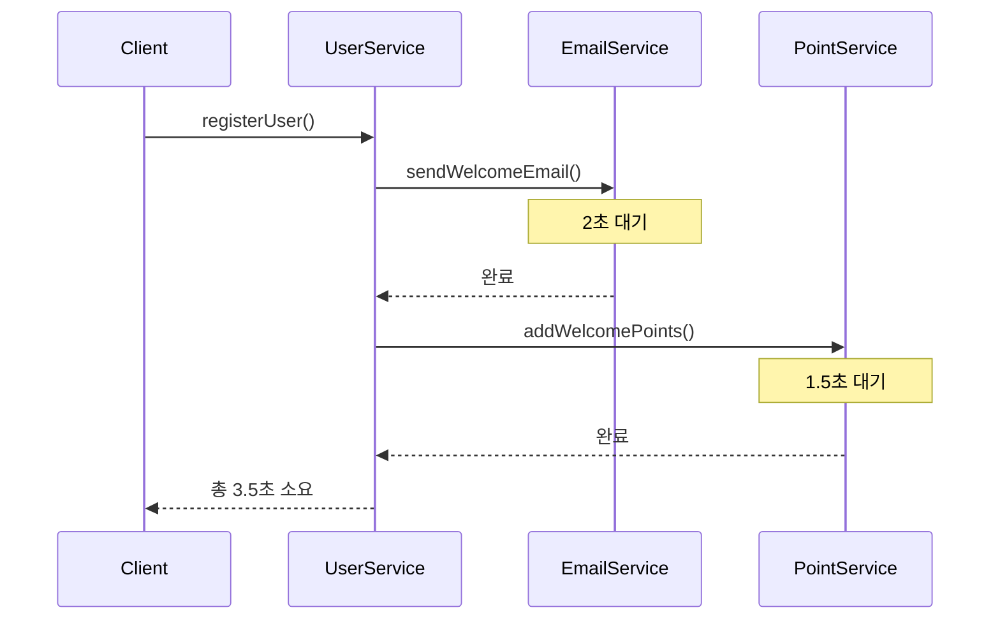
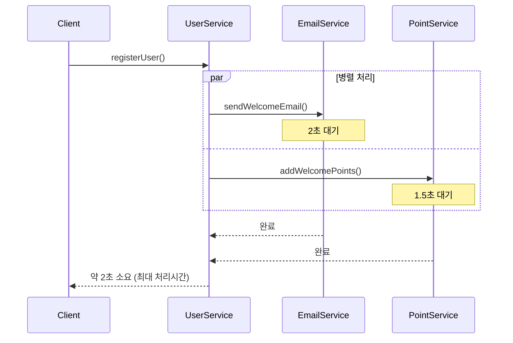

# Java 비동기 처리

## 프로젝트 개요

Java에서 비동기 처리를 하는 다양한 방식들을 학습하고 비교하는 프로젝트입니다.
"회원가입시 메일 발송과 포인트 적립" 시나리오를 통해 각 방식의 동작 원리와 성능을 분석합니다.

## 비동기 처리 방식별 비교

### 1. Thread 방식

- **패키지**: `com.f1v3.async.thread`
- **특징**: 매번 새로운 스레드 생성
- **장점**: 간단한 구현, 병렬 처리 가능
- **단점**: 스레드 생성/제거 비용, 스레드 수 제어 어려움

### 2. ExecutorService (ThreadPool) 방식

- **패키지**: `com.f1v3.async.executorservice`
- **특징**: 스레드 풀을 사용하여 스레드 재사용
- **장점**: 스레드 생성/제거 비용 절약, 스레드 수 제어 가능
- **단점**: 적절한 풀 크기 설정 필요, 복잡한 구현

### 3. Future 방식

- **패키지**: `com.f1v3.async.future`
- **특징**: ExecutorService의 결과를 Future로 추적
- **장점**: 작업 결과 확인 가능, 타임아웃 설정 가능, 취소 가능
- **단점**: 블로킹 방식, 복잡한 체이닝 어려움

### 4. CompletableFuture 방식

- **패키지**: `com.f1v3.async.completablefuture`
- **특징**: 함수형 프로그래밍 스타일의 비동기 처리
- **장점**: 체이닝 가능, 조합 가능, 예외 처리 용이, 논블로킹
- **단점**: 복잡한 API, 학습 곡선

### 5. Spring Async 방식

- **패키지**: `com.f1v3.async.springasync`
- **특징**: Spring의 @Async 어노테이션을 사용한 비동기 처리
- **장점**: 간단한 설정, Spring 생태계 통합, AOP 기반
- **단점**: Spring 프록시 제한, 같은 클래스 내 호출 불가

## 시스템 아키텍처

### 공통 서비스



### 동기 vs 비동기 처리 플로우

#### 동기 처리 (Sequential)



#### 비동기 처리 (Parallel)



## 각 방식별 내부 동작

### 1. Thread 방식

```mermaid
graph TD
    A[회원가입 요청] --> B[Thread 1 생성]
    A --> C[Thread 2 생성]
    B --> D[EmailService 실행]
    C --> E[PointService 실행]
    D --> F[Thread.join() 대기]
    E --> F
    F --> G[모든 작업 완료]
    
    style B fill:#ffcccc
    style C fill:#ffcccc
    style F fill:#ffffcc
```

### 2. ExecutorService 방식

```mermaid
graph TD
    A[회원가입 요청] --> B[ThreadPool에서 스레드 할당]
    B --> C[Future 1: Email Task]
    B --> D[Future 2: Point Task]
    C --> E[EmailService 실행]
    D --> F[PointService 실행]
    E --> G[Future.get() 대기]
    F --> G
    G --> H[모든 작업 완료]
    
    I[ThreadPool] --> B
    style I fill:#ccffcc
    style G fill:#ffffcc
```

### 3. Future 방식

```mermaid
graph TD
    A[회원가입 요청] --> B[ExecutorService.submit()]
    B --> C[Future&lt;String&gt; emailFuture]
    B --> D[Future&lt;String&gt; pointFuture]
    C --> E[EmailService 실행]
    D --> F[PointService 실행]
    E --> G[결과 반환]
    F --> H[결과 반환]
    G --> I[Future.get() 블로킹]
    H --> I
    I --> J[결과 조합 및 완료]
    
    style I fill:#ffffcc
    style J fill:#ccffff
```

### 4. CompletableFuture 방식

```mermaid
graph TD
    A[회원가입 요청] --> B[CompletableFuture.supplyAsync()]
    B --> C[emailFuture]
    B --> D[pointFuture]
    C --> E[EmailService 실행]
    D --> F[PointService 실행]
    E --> G[thenCombine()]
    F --> G
    G --> H[결과 체이닝]
    H --> I[논블로킹 완료]
    
    style G fill:#ccffff
    style I fill:#ccffcc
```

### 5. Spring Async 방식

```mermaid
graph TD
    A[회원가입 요청] --> B[@Async 메서드 호출]
    B --> C[Spring AOP 프록시]
    C --> D[TaskExecutor]
    D --> E[비동기 메서드 실행]
    E --> F[CompletableFuture 반환]
    F --> G[결과 대기 또는 체이닝]
    G --> H[Spring 컨텍스트 관리]
    
    style C fill:#ffccff
    style D fill:#ccffcc
    style H fill:#ffffcc
```

## 성능 비교 결과 (예상)

| 방식                | 단일 처리 시간 | 대량 처리 효율성 | 메모리 사용량 | 복잡도 |
|-------------------|----------|-----------|---------|-----|
| 동기                | ~3.5초    | 낮음        | 낮음      | 낮음  |
| Thread            | ~2초      | 중간        | 높음      | 낮음  |
| ExecutorService   | ~2초      | 높음        | 중간      | 중간  |
| Future            | ~2초      | 높음        | 중간      | 중간  |
| CompletableFuture | ~2초      | 높음        | 중간      | 높음  |
| Spring Async      | ~2초      | 높음        | 중간      | 낮음  |

## 실행 방법

### 개별 방식 테스트

```bash
# 1. Thread 방식
./gradlew bootRun --args='--spring.main.class=com.f1v3.async.thread.ThreadApplication'

# 2. ExecutorService 방식
./gradlew bootRun --args='--spring.main.class=com.f1v3.async.executorservice.ExecutorServiceApplication'

# 3. Future 방식
./gradlew bootRun --args='--spring.main.class=com.f1v3.async.future.FutureApplication'

# 4. CompletableFuture 방식
./gradlew bootRun --args='--spring.main.class=com.f1v3.async.completablefuture.CompletableFutureApplication'

# 5. Spring Async 방식
./gradlew bootRun --args='--spring.main.class=com.f1v3.async.springasync.SpringAsyncApplication'
```

### 통합 성능 테스트

```bash
./gradlew test --tests AsyncPerformanceTest
```

## 학습 포인트

### 1. 언제 어떤 방식을 사용할까?

- **Thread**: 간단한 일회성 비동기 작업
- **ExecutorService**: 스레드 수 제어가 필요한 경우
- **Future**: 작업 결과가 필요하고 타임아웃 처리가 필요한 경우
- **CompletableFuture**: 복잡한 비동기 체이닝이 필요한 경우
- **Spring Async**: Spring 환경에서 간단한 비동기 처리

### 2. 성능 고려사항

- **스레드 생성 비용**: Thread < ExecutorService 재사용
- **메모리 사용량**: 스레드 수가 많을수록 메모리 사용량 증가
- **CPU 활용도**: 적절한 스레드 풀 크기 설정 중요
- **응답성**: 논블로킹 방식이 더 나은 사용자 경험 제공

### 3. 실무 적용 시 주의사항

- **예외 처리**: 비동기 작업의 예외 처리 방법
- **트랜잭션**: 비동기 작업과 데이터베이스 트랜잭션 경계
- **모니터링**: 비동기 작업의 성능 모니터링 방법
- **테스트**: 비동기 코드의 단위 테스트 작성법

## 프로젝트 구조

```
src/main/java/com/f1v3/async/
├── common/                 # 공통 서비스
│   ├── EmailService.java
│   └── PointService.java
├── thread/                 # Thread 방식
├── executorservice/        # ExecutorService 방식
├── future/                 # Future 방식
├── completablefuture/      # CompletableFuture 방식
└── springasync/           # Spring Async 방식
```

## 결론

각 비동기 처리 방식은 고유한 장단점을 가지고 있으며, 사용 상황에 따라 적절한 방식을 선택하는 것이 중요합니다.
이 프로젝트를 통해 실제 코드와 성능 테스트를 통해 각 방식의 특성을 이해하고,
실무에서 적절한 비동기 처리 방식을 선택할 수 있는 기준을 마련할 수 있습니다.
